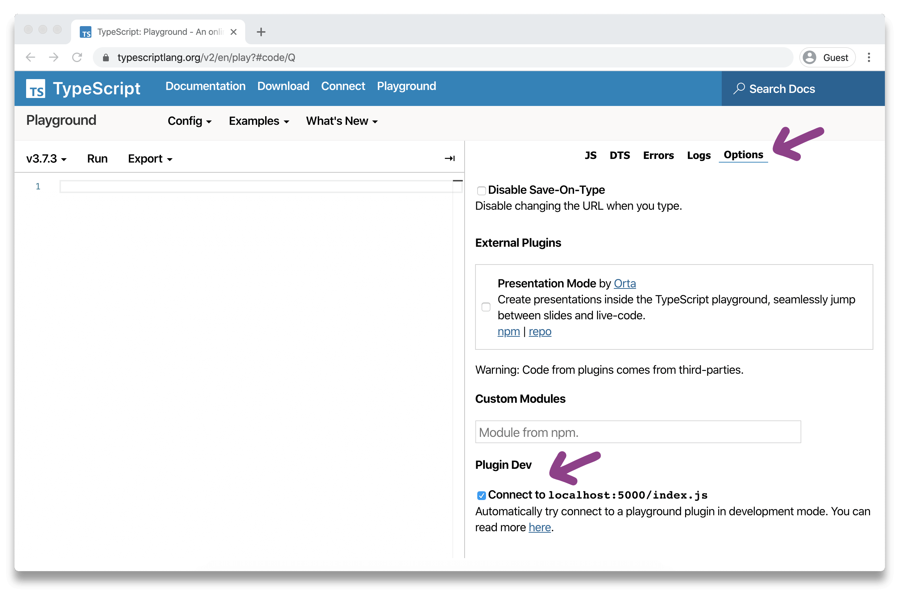
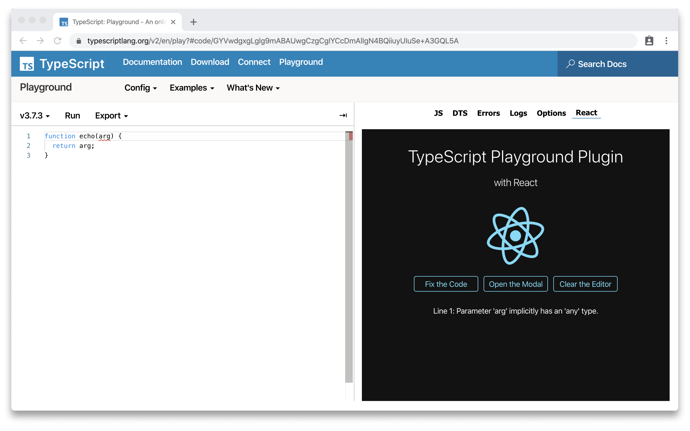

# typescript-playground-plugin-react

Easily create TypeScript [Playground Plugins](https://www.typescriptlang.org/v2/dev/playground-plugins/) with [React](https://reactjs.org/).

> 🚧 This project is experimental so please use with caution. If you have any ideas on how to improve this library, any contributions are welcomed. Also, TypeScript Playground plugins currently only work in Chromium based browsers.

## Table Of Contents

1. [Features](#features)
1. [About](#about)
1. [Getting Started](#getting-started)
1. [usePlugin Hook](#usePlugin-hook)
1. [Styling Your Plugin](#styling-your-plugin)
1. [More about TypeScript Playground Plugins](#more-about-typescript-playground-plugins)

## Features

✅ Write your TypeScript Playground plugin in React and TypeScript.

✅ Interact with the Playground using a strongly-typed React hook.

✅ Create styles with stylesheets or CSS-in-JS with Goober.

✅ Linting with ESLint

## About

The TypeScript Playground V3 beta comes packed with lots of new features, including the ability to create plugins. Per the TypeScript docs:

> The new TypeScript Playground allows people to hook into the Playground and extend it in ways in which the TypeScript team don't expect.
>
> The sidebar of the Playground uses the same plugin infrastructure as external plugins, so you have the same level of access as the playground to build interesting projects.
>
> Playground plugins have no fancy frameworks, you're free to inject them at runtime and use them if you need to - but the current plugins are built with the DOM APIs and TypeScript.

This package allows you to use React as a replacement (or addition to) the DOM APIs to create a rich, interactive UI for your plugin.

#### How does it work?

The TypeScript Playground Plugin API provides a factory function with lifecycle methods that are used to interact with the playground. This library works by mounting a React app inside of the `didMount` method that the API exposes. The `modelChanged` and `modelChangedDebounce` API methods are called any time the code in the editor changes. Custom events are used to broadcast the changes to a context that wraps the app component.

## Getting Started

#### Step 1. Get the Code

> Option 1: Clone the repo

```sh
git clone git@github.com:gojutin/typescript-playground-plugin-react.git
```

> Option 2: Click the "Use this template" button in GitHub [(Link)](https://github.com/gojutin/typescript-playground-plugin-react)

#### Step 2. Install dependencies

```sh
cd typescript-playground-plugin-react && yarn
```

#### Step 3. Start the development server

```sh
yarn start
```

This will start a development server in watch mode, serve the `dist` directory at `localhost:5000`, and automatically open the TypeScript Playground in Chrome. As you edit any files in the `src` directory, the app will recompile and update `dist/index.js`, which is the file that is served to the TypeScript Playground.

> _Note: This does not reload the browser when your files change. In order to see your changes, the browser will need to be manually reloaded each time you make changes to the plugin._

#### Step 4. Configure and use your plugin

Visit [https://www.typescriptlang.org/v2/en/play](https://www.typescriptlang.org/v2/en/play).

Select the **Options** tab and tick the box for **Connect to localhost:5000/index.js**.



Now, **refresh the browser**. When the playground reloads, a new tab with your plugin should appear! 🎉



You can make customizations to your plugin by modifying the `customPlugin` object in `src/index.tsx`. For instance, you can change the `displayName` property to change the tab label text for your plugin. See the `PlaygroundPlugin` interface in `src/plugin/vendor/playground.d.ts` for all of the available options.

## `usePlugin` Hook

This hooks provides all of the method and properties provided by the Plugin API. It accepts a optional config object and returns an object with these properties:

### **code**

```typescript
string
```

The current code in the Monaco editor saved as React state. This value updates on change to the Monaco editor with optional debouncing. Uses `sandbox.getText()`

### **setCode**

```typescript
(code: string, options: {format: "prettier" | "monaco"}) => void
```

Set the code in the Monaco editor with optional formatting with Prettier or Monaco. Uses `sandbox.setText()`.

### **formatCode**

```typescript
() => void
```

Format the code in the Monaco editor. Alias for `sandbox.editor.getAction("editor.action.formatDocument").run()`.

### **prettier**

```typescript
(config?: Options) => string
```

Format the code in the Monaco editor with Prettier. Accepts a Prettier config object.

### **markers**

```typescript
(IMarker & {key: string})[]
```

Alias for `sandbox.monaco.editor.getModelMarkers({})` with added unique `key` property. Kept in sync via `sandbox.editor.onDidChangeModelDecorations`.

Here is the [type definition](https://github.com/Microsoft/monaco-editor/blob/master/monaco.d.ts#L875) for `IMarker`:

```typescript
interface IMarker {
  owner: string;
  resource: Uri;
  severity: MarkerSeverity;
  code?:
    | string
    | {
        value: string;
        link: Uri;
      };
  message: string;
  source?: string;
  startLineNumber: number;
  startColumn: number;
  endLineNumber: number;
  endColumn: number;
  relatedInformation?: IRelatedInformation[];
  tags?: MarkerTag[];
}
```

### **setDebounce**

```typescript
(debounce: boolean) => void
```
Optionally debounce the `modelChange` event from the Plugin API. Per the Plugin docs, this is run on a delay and may not fire on every keystroke. The `code` property will be updated accordingly. 

### **sandbox**

```typescript
object
```

A DOM library for interacting with TypeScript and JavaScript code, which powers the heart of the TypeScript playground. This object provides several properties and methods to interact with the playground. See all of the available types in `src/plugin/vendor/sandbox.d.ts` and read more about the sandbox at [http://www.typescriptlang.org/v2/dev/sandbox/](http://www.typescriptlang.org/v2/dev/sandbox/).

### **modal**

```typescript
object
```

The model is an object which Monaco uses to keep track of text in the editor. You can find the full type definition at `node_modules/monaco-editor/esm/vs/editor/editor.api.d.ts`.  

### **container**

```typescript
HTMLDivElement
```

This is the container `div` element that wraps the entire sidebar. The React app is mounted to this element. Any style changes to this element will affect the entire sidebar.

### **showModal**

```typescript
(code: string, subtitle?: string, links?: string[]) => void
```
From `window.playground.ui` - This function accepts three arguments (code, subtitle, and links) and opens a model with the values you provide.

### **flashInfo**

```typescript
(message: string) => void
```
From `window.playground.ui` - This function accepts one argument (message) and and flashes a quick message in the center of the screen. 

### **utils**

```typescript
{
  el: (str: string, el: string, container: Element) => void;, 
  requireURL: (path: string) => string;, 
  createASTTree: (node: Node) => HTMLDivElement;
}
```
An object that contains three additional config options and functionality. `el`, `requireURL`, and `createASTTree`. See `src/plugin/vendor/pluginUtils.d.ts` for more information. 
                                                                                                                           
<hr />

### Example `usePlugin` Usage

```tsx
const {
  code,
  setCode,
  formatCode,
  prettier,
  markers,
  setDebounce,
  sandbox,
  model,
  container,
  flashInfo,
  showModal
} = usePlugin();

// Here are some examples of things you can do:

setDebounce(true);

// Set the code in the Monaco editor
useEffect(() => {
  const defaultCode = `const greet = (): string => "Hi👋";`;
  setCode(defaultCode, { format: "prettier" });
}, []);

// Listen for changes to the code in the Monaco editor
useEffect(() => {
  flashInfo("The code was updated.");
  showModal(code, "Here is your code");
}, [code]);

const renderMarkers = markers.map(marker => {
  return <div key={marker.key}>{marker.message}</div>;
});

// See App.tsx for additional usage examples
```

## Styling your plugin

This library works with normal CSS stylesheets out of the box by inlining them using PostCSS. It also includes [Goober](https://github.com/cristianbote/goober), a super light-weight (<1KB) CSS-in-JS library. There are examples of both styling approaches in `src/App.tsx`. Any other styling solutions may require additional rollup configuration.

The `container` provided by the `usePlayground` hook can also be styled. Be careful as this will affect all tabs in the sidebar.

## More about TypeScript Playground Plugins

[Official Playground Plugin Documentation](https://www.typescriptlang.org/v2/dev/playground-plugins/)

You can create a plugin (without React) from the official plugin template:

```sh
npm init typescript-playground-plugin playground-my-plugin
```

For convenience, this repo contains the `CONTRIBUTING.md` file included in the official plugin template. This document contains useful information about how to work with the plugins.

The `src/plugin/vendor` directory contains all of the TypeScript type definitions for the TypeScript Playground Plugin API. This is the best place to find the various config options, properties, and methods that are available.

### Need inspiration?

[Orta](https://github.com/orta) created a really cool plugin that lets you create presentations in the TypeScript playground using Reveal.js. You can check it out here:

[https://github.com/orta/playground-slides](https://github.com/orta/playground-slides)

He also offered these plugin ideas in [this](https://www.reddit.com/r/typescript/comments/eywcn8/learn_how_to_make_a_typescript_playground_plugin/fglyuon/) reddit thread.

- Explain the parts of a complex TS type
- Show TS -> Flow interfaces
- Run tutorials in the playground against live code
- AST Viewer
- ts-query runner
- codemod runner
- Highlight TS vs JS code
- Show all used types
- Show dts files
